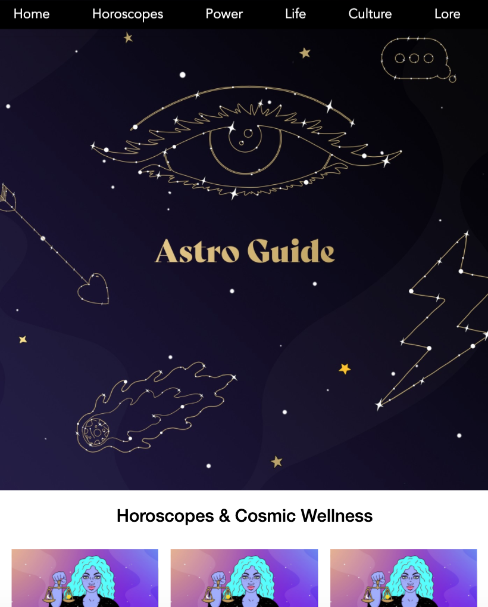
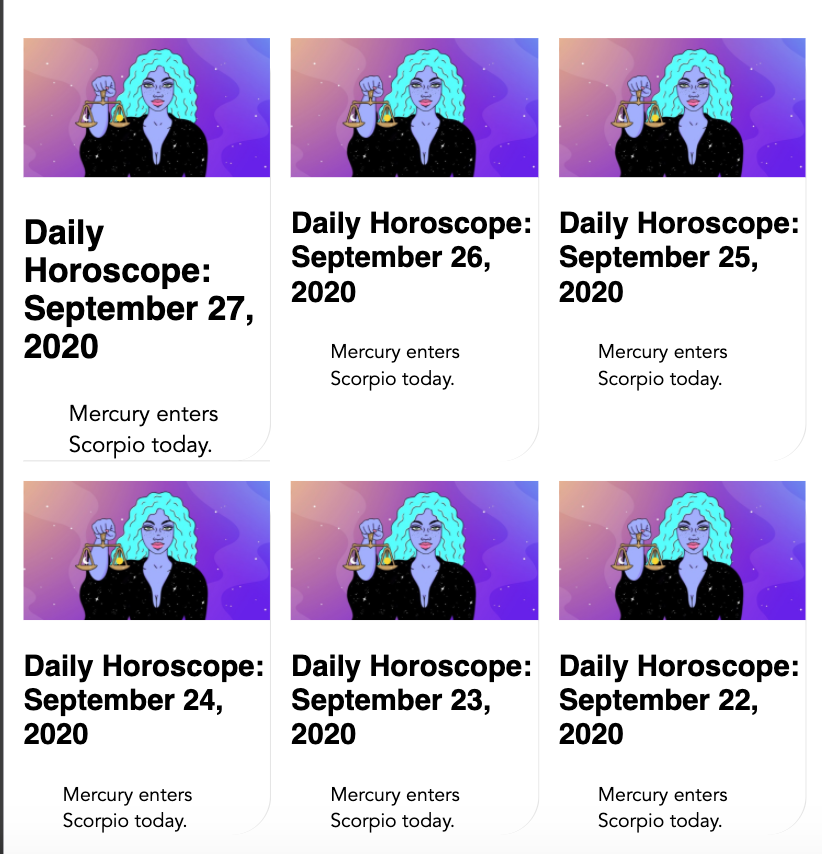
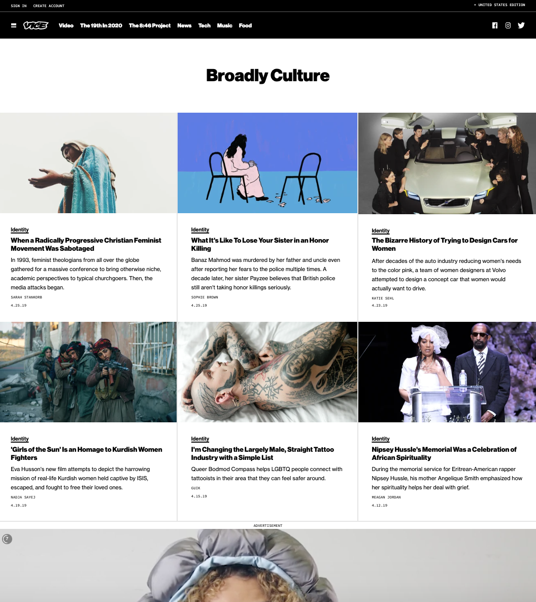
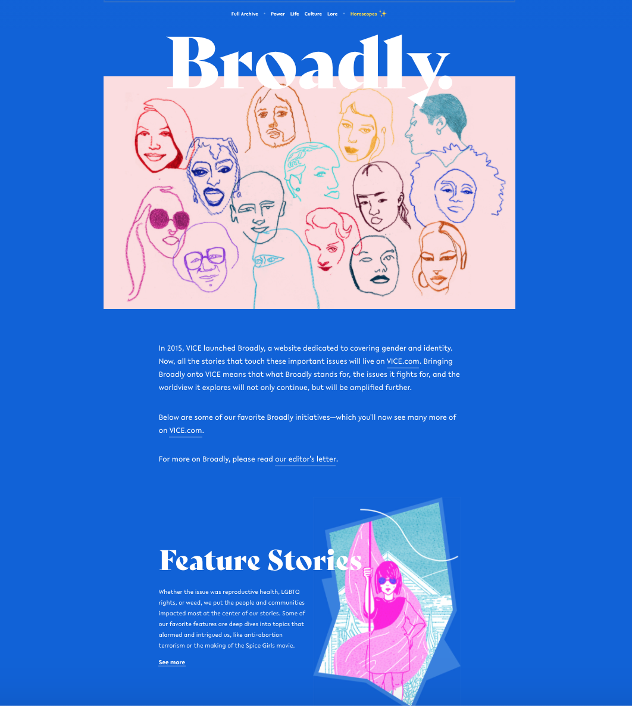

# Procesverslag
**Auteur:** Babice

Markdown cheat cheet: [Hulp bij het schrijven van Markdown](https://github.com/adam-p/markdown-here/wiki/Markdown-Cheatsheet). Nb. de standaardstructuur en de spartaanse opmaak zijn helemaal prima. Het gaat om de inhoud van je procesverslag. Besteedt de tijd voor pracht en praal aan je website.

## Bronnenlijst
1. -bron 1-
2. -bron 2-
3. -...-

## Eindgesprek (week 7/8)

-dit ging goed & dit was lastig-

**Screenshot(s):**

-screenshot(s) van je eindresultaat-

## Voortgang 3 (week 6)

## Voortgang 2 (week 5)

In week 4 heb ik alleen de oefeningen gemaakt voor de lessen omdat de andere vakken allemaal een oplevering hadden die 33% meetelde met het eindcijfer. 

In week 5 ben ik hard aan de slag gegaan met mijn tweede pagina en het verbeteren van de eerste pagina. Ik liep tegen een aantal kleine dingen aan zoals de nav bar die niet helemaal lukte. Ook waren de grids op pagina 2 lastig. 

**Screenshot(s):**

 
 
 
 

### Agenda voor meeting

Broadly:
Afbeelding moet naar de andere kant van pagina
Content onder menu laat zich niet zien
Link moet center onder tekst 

Horoscope:
p staat niet in het midden in sectionjb 

## Voortgang 1 (week 3)

### Stand van zaken

Het opzetten van mijn style guide was heel goed te doen. Ik kon alle informatie makkelijk vinden. Bij de oefeningen moest ik wel echt weer inkomen, maar dat ging snel.

In week 2 zette ik mijn style guide in html. Ik merkte dat ik veel basis dingen was vergeten en het duurde even voordat ik een goede opzet had. Nu heb ik alleen moeite met de positionering van responsive afbeeldingen.

In week 3 begon ik met de website. Doordat ik mijn style guide in dezelfde stijl als mijn website heb gedaan, wist ik al hoe in grote lijnen mijn website opgebouwd moest worden. Ik heb alleen moeite met de positionering van de afbeeldingen en mijn lettertype in html en css zetten.

**Screenshot(s):**

 

### Agenda voor meeting

### Verslag van meeting

gebruik liefst geen px maar em
h2 + p wordt section
boven eerste p een h...
h1 titel pagina maken
menu = position:fixed;
alt=visual interface background img 

## Intake (week 1)

**je startniveau** - blauw

**je focus** - responsive design

**je opdracht** -https://www.vice.com/en_us/broadly-

**Screenshot(s):**

**Breakdown-schets(en):**

(images/breakdownschets.frontend.png)
