# Procesverslag
**Auteur:** Babice

Markdown cheat cheet: [Hulp bij het schrijven van Markdown](https://github.com/adam-p/markdown-here/wiki/Markdown-Cheatsheet). Nb. de standaardstructuur en de spartaanse opmaak zijn helemaal prima. Het gaat om de inhoud van je procesverslag. Besteedt de tijd voor pracht en praal aan je website.

## Bronnenlijst
1. https://css-tricks.com/
2. https://www.w3schools.com/
3. Studentassistenten Kris & Sam
4. Klasgenoten Marlene, Anousha en First

## Eindgesprek (week 9)

In de herkansing heb ik de feedback verwerkt die ik ontving. Ik heb ook de navbar aangepast omdat ik daar vorige keer geen tijd meer voor had.
Met een aantal dingen had ik hulp nodig van klasgenoten en studentassistenten. Daarnaast heb ik zelf nog veel geleerd. 

**Screenshot(s):**
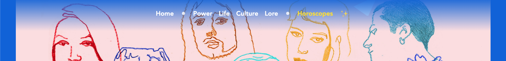 
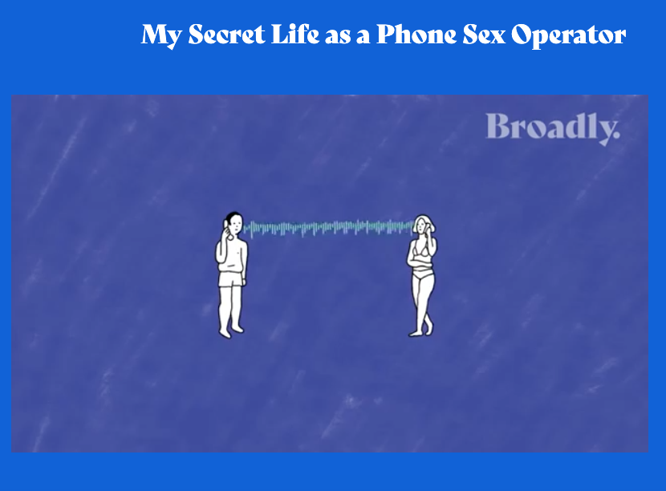
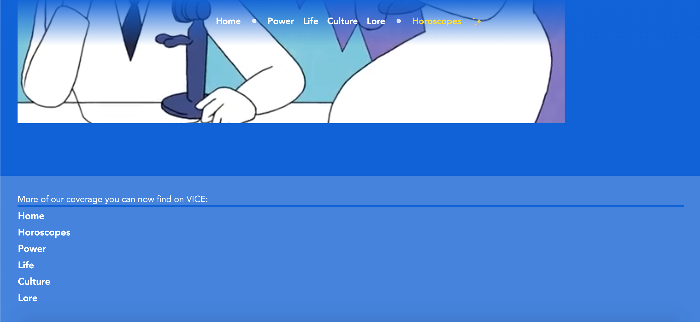
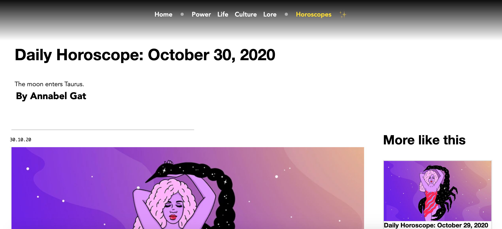

### Verslag van meeting

Microanimatie roept verkeerde elementen op
Niet divers
Horizontaal scrollbaar
alt tags img

## Eindgesprek (week 7/8)

Ik had heel veel moeite met het responsive maken van beide header afbeeldingen en de columns op pagina twee (astrology). Ik heb 3 klasgenootjes om hulp gevraagd en uiteindelijk is dat gelukt. De positionering en grids op de homepagina van de  artikels met foto's heading en p waren lastig goed in een grid te zetten maar dat is ook gelukt. Ik had veel moeite met deze opdracht en heb veel hulp gevraagd. Het is zeker niet perfect maar met mijn blauwe piste en lastige site ben ik er toch trots op!

**Screenshot(s):**
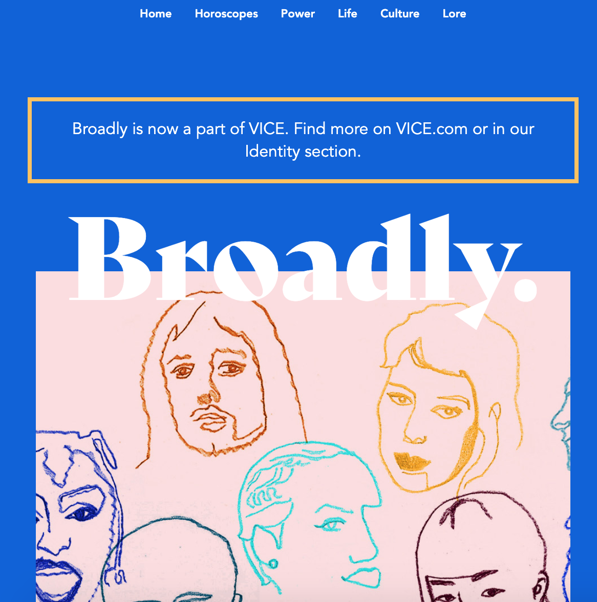 
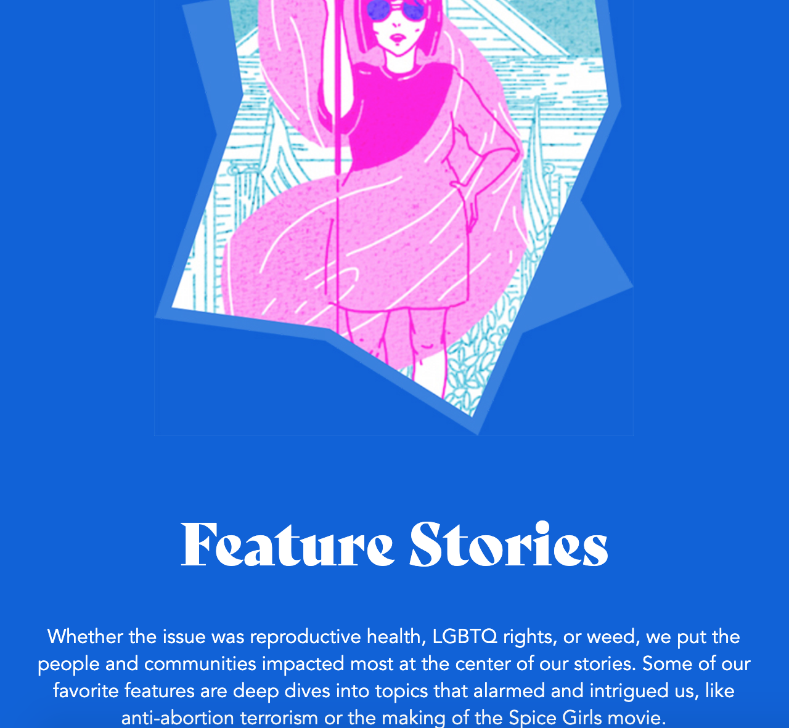
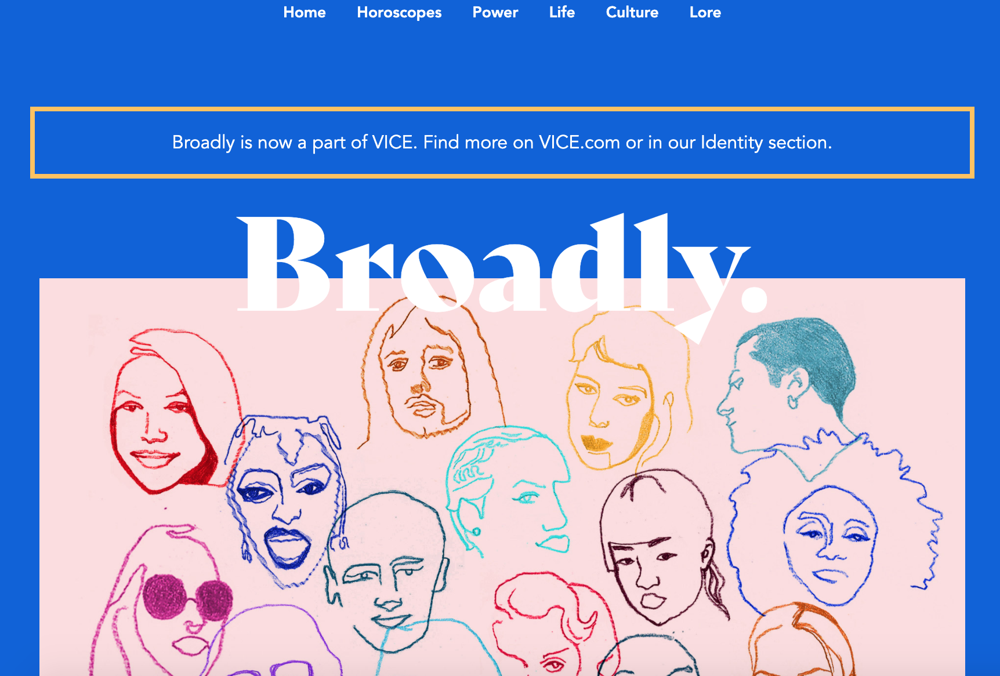
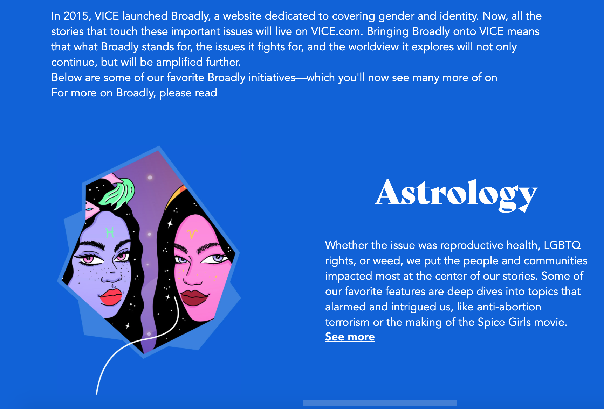
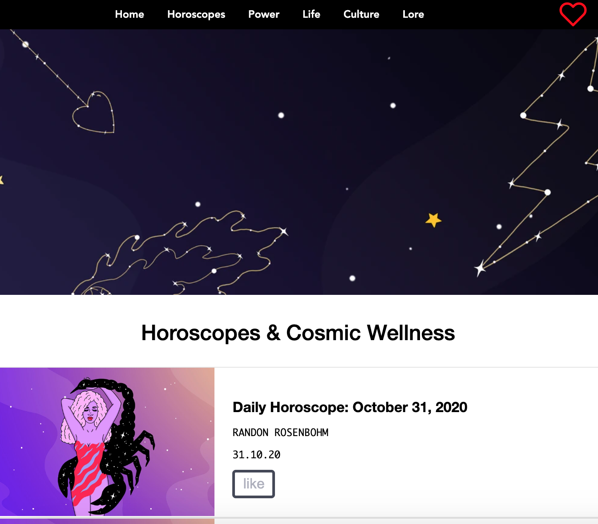 
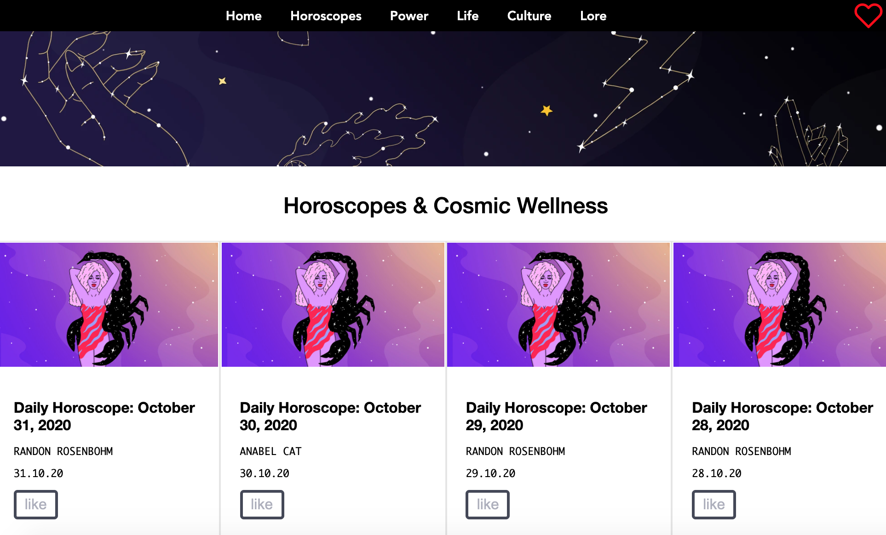 

## Voortgang 3 (week 6)

In week 5 ben ik aan de slag gegaan met de feedback die ik kreeg in voortgang 2.

**Screenshot(s):**

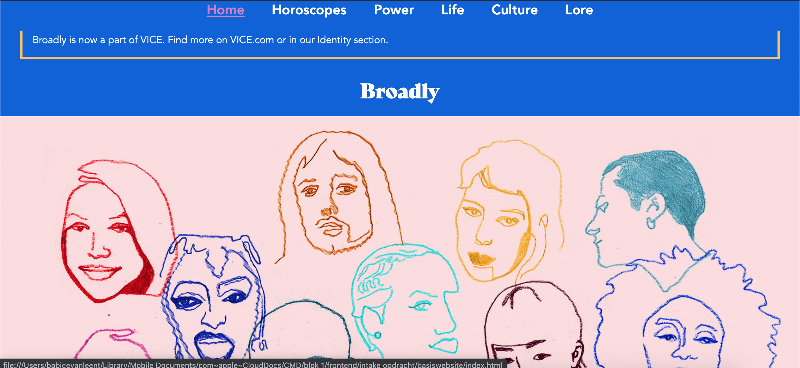 
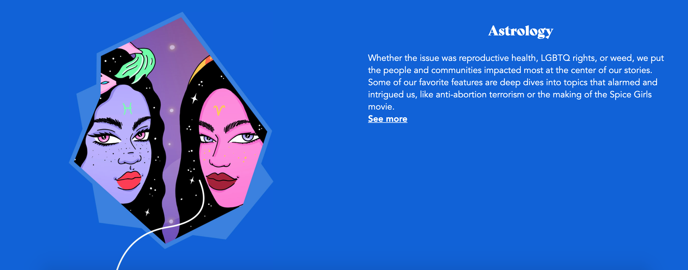 
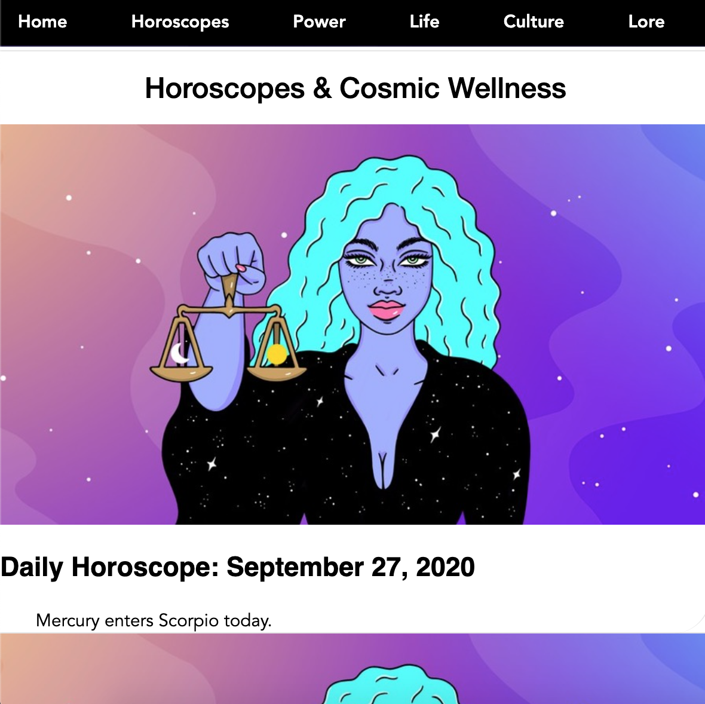 
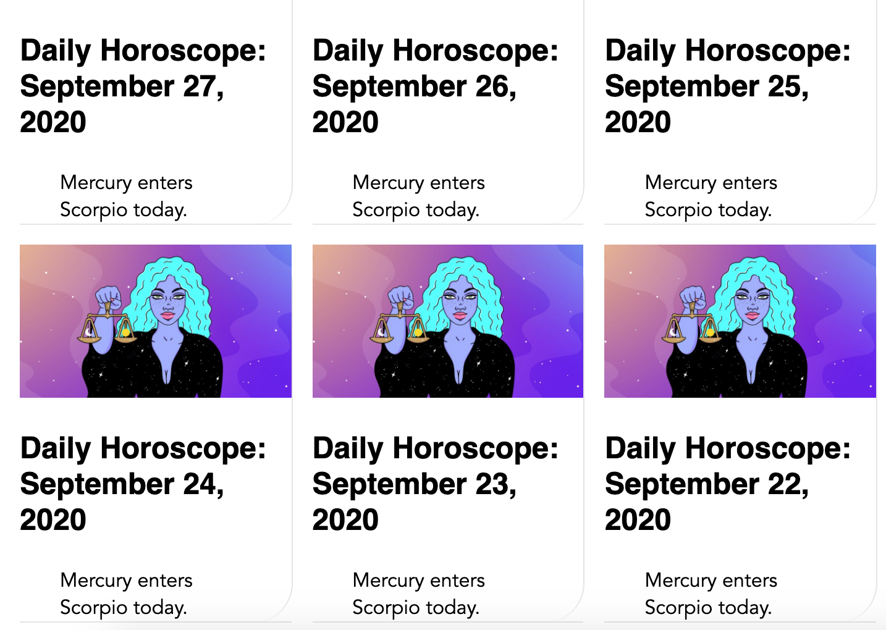 

### Agenda voor meeting

Content onder menu laat zich niet zien
Moeite met animatie begrijpen

## Voortgang 2 (week 5)

In week 4 heb ik alleen de oefeningen gemaakt voor de lessen omdat de andere vakken allemaal een oplevering hadden die 33% meetelde met het eindcijfer. 

In week 5 ben ik hard aan de slag gegaan met mijn tweede pagina en het verbeteren van de eerste pagina. Ik liep tegen een aantal kleine dingen aan zoals de nav bar die niet helemaal lukte. Ook waren de grids op pagina 2 lastig. 

**Screenshot(s):**

 
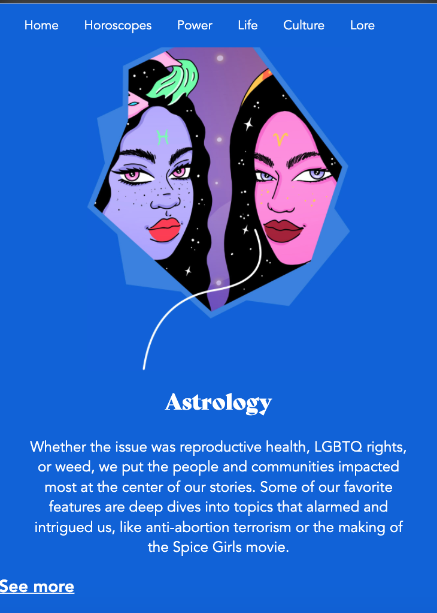 
 
 

### Agenda voor meeting

Broadly:
Afbeelding moet naar de andere kant van pagina
Link moet center onder tekst 

Horoscope:
p staat niet in het midden in section

### Verslag van meeting

Time element op data zetten in horoscope
Margin op p uit in horoscope grid
h3 verwijderen in a

## Voortgang 1 (week 3)

### Stand van zaken

Het opzetten van mijn style guide was heel goed te doen. Ik kon alle informatie makkelijk vinden. Bij de oefeningen moest ik wel echt weer inkomen, maar dat ging snel.

In week 2 zette ik mijn style guide in html. Ik merkte dat ik veel basis dingen was vergeten en het duurde even voordat ik een goede opzet had. Nu heb ik alleen moeite met de positionering van responsive afbeeldingen.

In week 3 begon ik met de website. Doordat ik mijn style guide in dezelfde stijl als mijn website heb gedaan, wist ik al hoe in grote lijnen mijn website opgebouwd moest worden. Ik heb alleen moeite met de positionering van de afbeeldingen en mijn lettertype in html en css zetten.

**Screenshot(s):**

 

### Agenda voor meeting

### Verslag van meeting

gebruik liefst geen px maar em
h2 + p wordt section
boven eerste p een h...
h1 titel pagina maken
menu = position:fixed;
alt=visual interface background img 

## Intake (week 1)

**je startniveau** - blauw

**je focus** - responsive design

**je opdracht** -https://www.vice.com/en_us/broadly-

**Screenshot(s):**

**Breakdown-schets(en):**

(images/breakdownschets.frontend.png)
